# IntelliSearch

### Building an Intelligent Search Engine from First Principles

> From classical Information Retrieval to semantic search and Search-as-a-Service.

IntelliSearch is an open-source learning and engineering project focused on understanding, implementing, and evolving a modern search engine.

We start with the fundamentals — **text preprocessing, inverted indexes, TF-IDF, and BM25** — and progressively introduce **query understanding, semantic retrieval, vector search, hybrid ranking, and Transformer-based reranking**.

The long-term goal is to turn the search engine into a **Search-as-a-Service platform** that applications can integrate through APIs and SDKs.

---

## Table of Contents

* [Vision](#vision)
* [What Are We Building?](#what-are-we-building)
* [Search Engine at a Glance](#search-engine-at-a-glance)
* [Core Features](#core-features)
* [Search Architecture](#search-architecture)
* [How Search Works](#how-search-works)
* [Classical Information Retrieval](#classical-information-retrieval)
* [Query Understanding](#query-understanding)
* [Semantic Search](#semantic-search)
* [Hybrid Search](#hybrid-search)
* [Search-as-a-Service](#search-as-a-service)
* [Indexing Pipeline](#indexing-pipeline)
* [Technology Direction](#technology-direction)
* [Development Roadmap](#development-roadmap)
* [Project Structure](#project-structure)
* [Team Workstreams](#team-workstreams)
* [Engineering Principles](#engineering-principles)
* [Getting Started](#getting-started)
* [Contributing](#contributing)

---

# Vision

Search has evolved from simple keyword matching into systems that understand:

* what the user typed
* what the user meant
* which entities they are referring to
* what information is relevant
* how different signals should influence ranking

IntelliSearch aims to explore this evolution step by step.

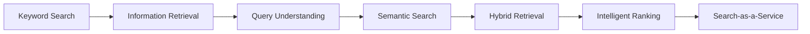

The goal is **not** to skip the fundamentals.

The goal is to understand the fundamentals well enough to build the modern layers on top of them.

---

# What Are We Building?

At its core:

```text
Documents
     ↓
Preprocessing
     ↓
Indexing
     ↓
Retrieval
     ↓
Scoring
     ↓
Ranking
     ↓
Results
```

The system will gradually evolve into:

```text
                    IntelliSearch

                         │
          ┌──────────────┼──────────────┐
          ↓              ↓              ↓
    Keyword Search  Semantic Search  Query Understanding
          │              │              │
          └──────────────┼──────────────┘
                         ↓
                  Candidate Retrieval
                         ↓
                    Hybrid Ranking
                         ↓
                     Reranking
                         ↓
                    Final Results
```

---

# Search Engine at a Glance

A search engine has two major workloads.

## Offline / Indexing

Documents are processed and prepared for fast retrieval.

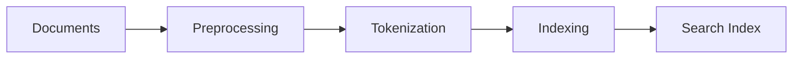

## Online / Search

A user's query is processed and used to retrieve and rank relevant documents.

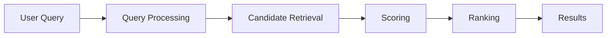

Together:

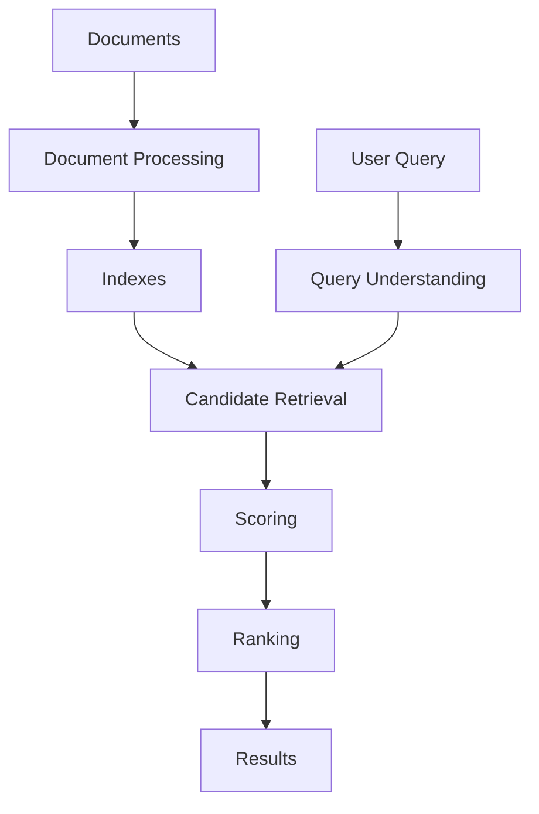

---

# Core Features

The project will be built incrementally.

### 🔎 Classical Retrieval

* Text preprocessing
* Tokenization
* Stop-word handling
* Stemming / normalization
* Inverted index
* Positional index
* Term frequency
* Document frequency
* TF-IDF
* BM25
* Boolean retrieval
* Phrase search
* Proximity search

### 🧠 Query Intelligence

* Spell correction
* Synonym expansion
* Query rewriting
* Intent detection
* Entity extraction
* Entity linking

### 🤖 Semantic Search

* Text embeddings
* Transformer-based representations
* Dense retrieval
* Vector search
* Approximate Nearest Neighbor search
* HNSW

### 🔀 Hybrid Search

Combine multiple retrieval signals:

```text
BM25
 +
Semantic Similarity
 +
Entity / Metadata Signals
 +
Filters
      ↓
Candidate Set
      ↓
Ranking / Reranking
```

### ⚡ Platform Features

* REST APIs
* Python SDK
* Java SDK
* Index management
* Document ingestion
* Multi-tenancy
* API authentication
* Configurable ranking
* Synonym management
* Search playground
* Search analytics

---

# Search Architecture

The long-term architecture:

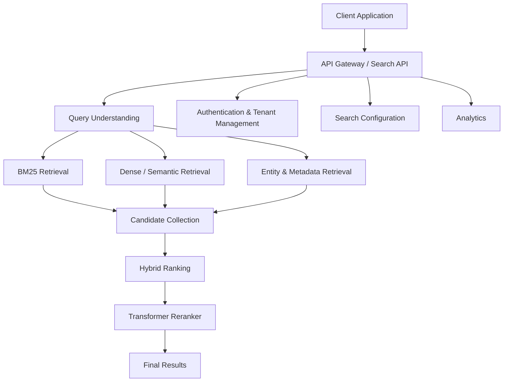

The architecture will evolve as the project grows. Early implementations will intentionally remain simpler rather than prematurely splitting everything into microservices.

---

# How Search Works

A simplified search request:

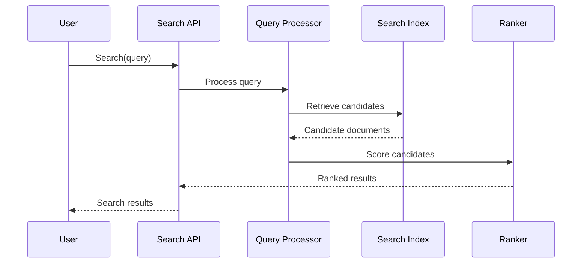

The important distinction is:

> **Retrieval finds candidates. Ranking decides their order.**

---

# Classical Information Retrieval

## Inverted Index

A naive search engine could scan every document:

```text
Query
  ↓
Document 1
Document 2
Document 3
...
Document N
```

An inverted index reverses the relationship:

```text
machine  → D1, D4
learning → D1, D2, D4
neural   → D2
```

Conceptually:

```text
term
 ↓
posting list
 ↓
documents containing the term
```

For positional indexing:

```text
learning → [
    (D1, [2, 7]),
    (D2, [4]),
    (D4, [1, 8])
]
```

Positions allow us to support operations such as:

* phrase search
* proximity search
* term frequency calculations

---

## TF-IDF

TF-IDF combines two ideas.

### Term Frequency

How frequently does a term occur in a document?

```text
TF(term, document)
```

### Inverse Document Frequency

How rare is the term across the collection?

```text
IDF(term)
```

Together:

```text
TF-IDF = TF × IDF
```

A common word appearing in almost every document provides less discrimination than a rare term.

---

# BM25

TF-IDF provides a foundation for relevance scoring.

BM25 improves on this idea by considering factors such as:

* term frequency
* document frequency
* document length
* term saturation

Conceptually:

```text
Query
  ↓
Matching terms
  ↓
BM25 score
  ↓
Rank documents
```

BM25 will become one of the main lexical retrieval methods in IntelliSearch.

---

# Query Understanding

Users don't always express their intent using the exact words found in documents.

Consider:

```text
"iphon 17"
```

Potential processing:

```text
Raw Query
    ↓
Spell Correction
    ↓
"iphone 17"
```

Another example:

```text
"cheap chicken nearby"
```

Possible interpretation:

```text
Entity / Topic → chicken
Constraint     → cheap
Location       → nearby
```

Query understanding may include:

```text
Spell Correction
        ↓
Normalization
        ↓
Synonym Expansion
        ↓
Intent Detection
        ↓
Entity Extraction
        ↓
Query Rewriting
```

These are separate capabilities and should not be treated as the same thing as semantic search.

---

# Semantic Search

Traditional retrieval primarily relies on lexical matching.

Semantic retrieval represents text as vectors.

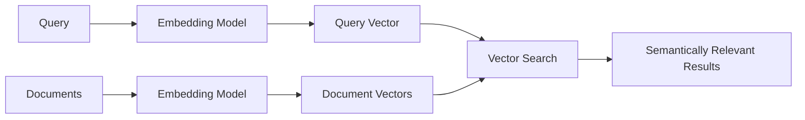

Example:

```text
Query:
"reduce API response time"

Potentially relevant document:
"how to improve server latency"
```

The exact words differ, but the concepts can be related.

---

# Transformers and BERT

Transformers introduced powerful contextual representations for language.

### Transformer

A neural architecture based heavily on attention mechanisms.

### BERT

A Transformer-based language model designed for contextual language understanding.

### Embeddings

Numerical vector representations of text.

```text
Text
 ↓
Transformer / Embedding Model
 ↓
Vector
 ↓
Vector Index
 ↓
Similarity Search
```

For search, Transformer-based models can be used for:

* embeddings
* semantic retrieval
* query understanding
* relevance scoring
* reranking

A model such as BERT is therefore one part of the broader semantic-search ecosystem rather than the entire search engine.

---

# Hybrid Search

Neither lexical nor semantic retrieval solves every search problem.

### Lexical search

Good at:

* exact terms
* product names
* identifiers
* technical terms
* version numbers

### Semantic search

Good at:

* related concepts
* paraphrases
* natural-language queries
* meaning-based matching

### Hybrid search

Combine the signals.

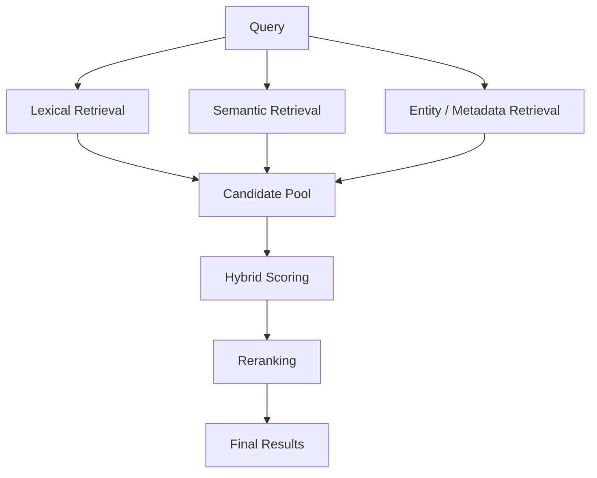

This becomes the central retrieval architecture of IntelliSearch.

---

# Search-as-a-Service

The long-term objective is to expose the search engine as a platform.

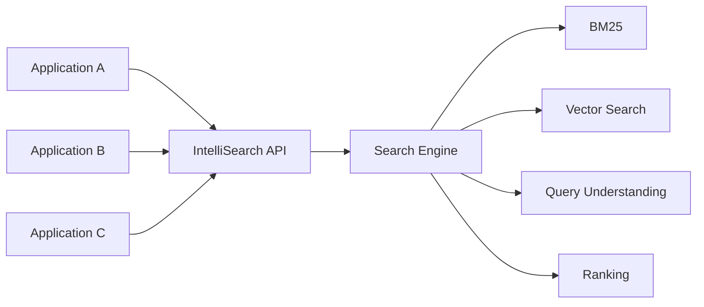

A client application should eventually be able to do something conceptually like:

```python
client.search(
    query="wireless headphones",
    index="products"
)
```

and receive:

```json
{
  "query": "wireless headphones",
  "results": [
    {
      "id": "product-123",
      "score": 0.92
    }
  ]
}
```

The exact API contract will evolve as implementation progresses.

---

# Indexing Pipeline

Applications need a way to send documents to IntelliSearch.

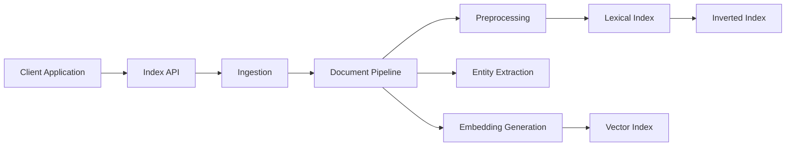

For larger workloads, asynchronous processing can later be introduced:

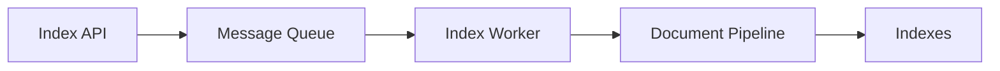

Kafka and other distributed components will be introduced when there is a concrete need for them.

---

# Technology Direction

IntelliSearch intentionally uses different technologies for different responsibilities.

| Area              | Direction                |
| ----------------- | ------------------------ |
| Core platform     | Java                     |
| APIs              | Spring Boot              |
| Search algorithms | Python / Java            |
| NLP / ML          | Python                   |
| Embeddings        | Transformer-based models |
| Database          | PostgreSQL               |
| Cache             | Redis                    |
| Messaging         | Kafka                    |
| Frontend          | React / Next.js          |
| Containers        | Docker                   |
| Vector retrieval  | ANN / HNSW               |
| SDKs              | Python + Java            |

This is a direction rather than a rigid requirement. Technology choices can change as implementation and benchmarking provide evidence.

---

# Development Roadmap

## Phase 0 — Foundations

```text
Preprocessing
     ↓
Tokenization
     ↓
Inverted Index
     ↓
Positional Index
     ↓
TF-IDF
     ↓
Basic Search
```

## Phase 1 — Classical IR

```text
Boolean Retrieval
Phrase Search
Proximity Search
Vector Space Model
Cosine Similarity
BM25
```

## Phase 2 — Search Quality

```text
Query Optimization
Index Compression
Caching
Evaluation
```

Metrics we will explore:

* Precision
* Recall
* F1
* MRR
* MAP
* NDCG
* p50 / p95 / p99 latency
* throughput / QPS

## Phase 3 — Query Intelligence

```text
Spell Correction
      ↓
Synonyms
      ↓
Query Rewriting
      ↓
Intent Detection
      ↓
Entity Extraction
```

## Phase 4 — Semantic Search

```text
Embeddings
    ↓
Dense Retrieval
    ↓
Vector Index
    ↓
ANN
    ↓
HNSW
```

## Phase 5 — Hybrid Search

```text
BM25
  +
Dense Retrieval
  +
Entity Signals
  +
Metadata Filters
       ↓
Candidate Generation
       ↓
Hybrid Ranking
```

## Phase 6 — Reranking

```text
Candidates
    ↓
Transformer / Cross-Encoder
    ↓
Relevance Score
    ↓
Final Ranking
```

## Phase 7 — Platform

```text
REST API
   ↓
Authentication
   ↓
Multi-tenancy
   ↓
Index Management
   ↓
SDKs
   ↓
Dashboard
   ↓
Analytics
```

---

# Project Structure

The project is organized around search concepts rather than putting the entire implementation into one file.

```text
intellisearch/
│
├── preprocessing.py
├── inverted_index.py
├── tfidf.py
├── search.py
├── index_persistence.py
│
├── boolean_retrieval.py
├── phrase_search.py
├── proximity_search.py
├── vector_space.py
├── cosine_similarity.py
├── bm25.py
│
├── query_optimizer.py
├── compression.py
├── cache.py
├── evaluation.py
│
├── crawler.py
├── document_pipeline.py
│
├── dense_retrieval.py
├── ann.py
├── hybrid_search.py
├── reranker.py
│
├── engine.py
│
├── documents.txt
├── tests/
├── docs/
└── README.md
```

The important principle is:

> **One concept → one understandable module.**

The final `engine.py` should orchestrate these components rather than contain every algorithm.

---

# Team Workstreams

The project can be divided into several parallel workstreams.

## 1. Core Search

Focus:

* preprocessing
* inverted index
* positional index
* TF-IDF
* BM25
* Boolean retrieval
* phrase search
* proximity search

## 2. Query Intelligence

Focus:

* spell correction
* synonyms
* query rewriting
* intent detection
* entity extraction
* entity linking

## 3. Semantic Search

Focus:

* embeddings
* Transformer models
* dense retrieval
* vector indexes
* ANN
* HNSW
* reranking

## 4. Platform

Focus:

* Spring Boot
* REST APIs
* authentication
* multi-tenancy
* index management
* document ingestion
* SDKs

## 5. Dashboard & Evaluation

Focus:

* React / Next.js
* search playground
* configuration
* analytics
* evaluation metrics
* performance monitoring

### Collaboration principle

Everyone should understand the **complete search pipeline**, even when working primarily on one area.

```text
Understand the whole system
          ↓
Specialize in a workstream
          ↓
Integrate with other components
          ↓
Measure the complete system
```

---

# Engineering Principles

### 1. Learn Before Abstracting

Understand the algorithm before hiding it behind a library.

### 2. Measure Before Optimizing

Use benchmarks and evaluation metrics rather than assumptions.

### 3. Keep Components Replaceable

The retrieval and ranking layers should be modular.

For example:

```text
BM25
 ↓
Replaceable Retrieval Interface
 ↓
Dense Retrieval
 ↓
Hybrid Retrieval
```

### 4. Separate Retrieval From Ranking

Retrieval answers:

> What could be relevant?

Ranking answers:

> Which relevant result should come first?

### 5. Start Simple

We will not begin with dozens of microservices.

The architecture should become more distributed only when scale, reliability, or team boundaries justify it.

---

# Getting Started

## Clone the repository

```bash
git clone <repository-url>
cd intellisearch
```

## Create a Python environment

```bash
python -m venv .venv
```

Activate it:

### Linux / macOS

```bash
source .venv/bin/activate
```

### Windows

```powershell
.venv\Scripts\activate
```

## Install dependencies

```bash
pip install -r requirements.txt
```

## Run the current implementation

The current learning implementation starts with:

```text
Documents
   ↓
Preprocessing
   ↓
Inverted Index
   ↓
TF-IDF
   ↓
Query
   ↓
Ranked Results
```

As the project evolves, the startup process and API will be documented here.

---

# Documentation

Additional technical documentation will live under:

```text
docs/
├── architecture/
├── information-retrieval/
├── query-understanding/
├── semantic-search/
├── ranking/
├── evaluation/
└── api/
```

Suggested documents:

```text
docs/
├── architecture.md
├── inverted-index.md
├── tfidf.md
├── bm25.md
├── query-understanding.md
├── semantic-search.md
├── hybrid-search.md
├── ranking.md
└── evaluation.md
```

Each document should explain both:

1. **The search-engine concept**
2. **Our implementation**

---

# Contributing

Contributions are welcome.

Before implementing a feature:

1. Understand where it fits in the search pipeline.
2. Read the relevant documentation.
3. Create or update tests.
4. Implement the smallest useful version.
5. Measure its behavior.
6. Document important design decisions.
7. Integrate it with the rest of the engine.

### Example workflow

```text
Issue / Feature
      ↓
Understand the concept
      ↓
Design
      ↓
Implement
      ↓
Test
      ↓
Benchmark / Evaluate
      ↓
Document
      ↓
Pull Request
```

---

# The Bigger Picture

IntelliSearch is not intended to be just another keyword-search implementation.

The project is an exploration of how search systems evolve:

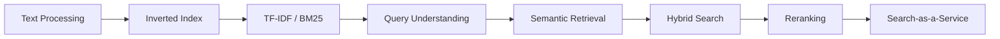

We start by understanding **how search works**.

Then we build it.

Then we measure it.

Then we make it intelligent.

---

# IntelliSearch

### Learn the fundamentals. Build the system. Make it intelligent.

**Build → Understand → Measure → Improve**

---
