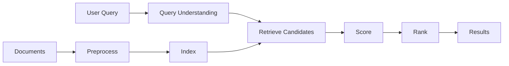
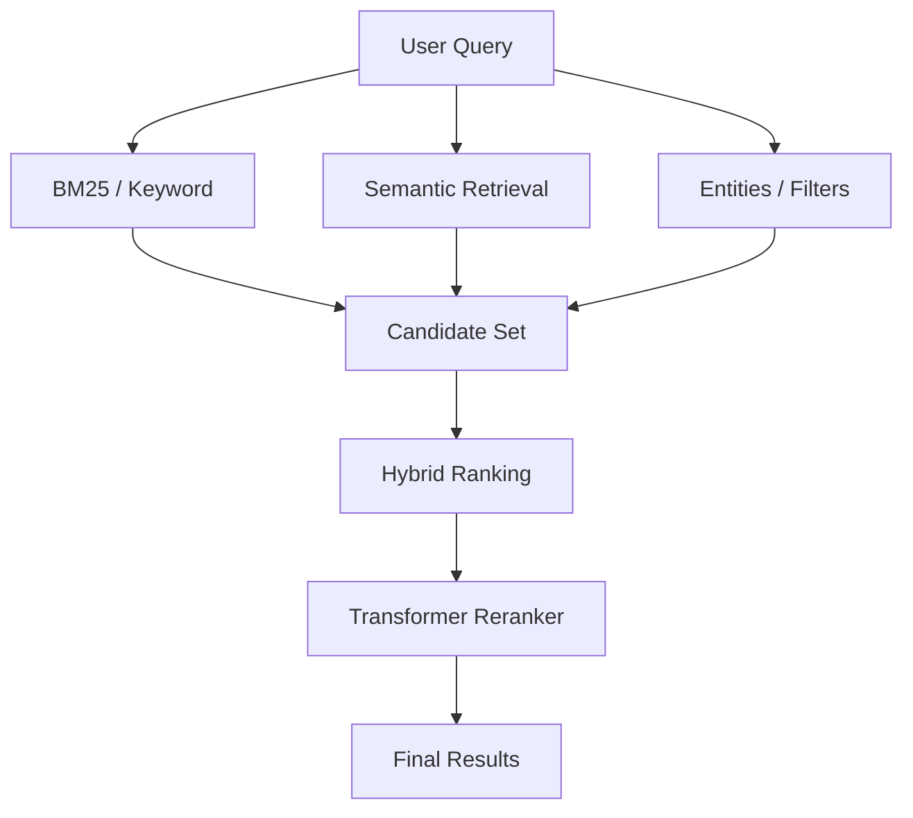
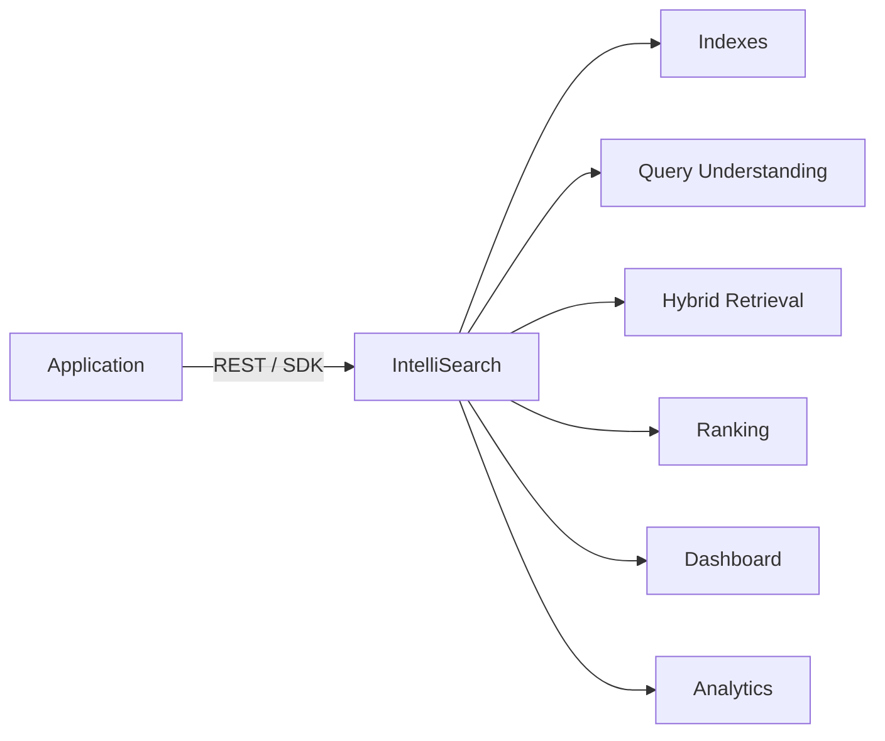

# IntelliSearch

### Building an Intelligent Search Engine

**From Information Retrieval → Semantic Understanding → Search-as-a-Service**

> One search system. Multiple ways to understand relevance.

<!-- notes: Open by saying this is both a learning project and a real engineering project. We are not starting with BERT or an API. We are starting with understanding how search actually works. -->

---

## Why Are We Building This?

Search looks simple.

You type a query.
You get results.

But a useful search engine has to answer three questions:

```text
        QUERY
          ↓
   What does the user mean?
          ↓
   What could be relevant?
          ↓
   What should appear first?
```

### Our goal

Build a search engine **from first principles**, then progressively make it intelligent.

<!-- notes: The key idea is that search is not just matching text. There is understanding, retrieval, and ranking. -->

---

## The Search Engine Pipeline



### Two sides of search

**Offline**
→ process documents and build indexes

**Online**
→ understand the query, retrieve candidates and rank them

<!-- notes: This diagram becomes our mental model for the entire project. Every feature we build should fit somewhere in this pipeline. -->

---

## Foundations: Information Retrieval

### 01 — Inverted Index

Instead of scanning every document:

```text
"machine learning"
       ↓
  scan all documents
```

we build:

```text
machine  → D1, D4
learning → D1, D2, D4
neural   → D2
```

**Query → Index → Candidate Documents**

---

### 02 — Ranking

Matching isn't enough.

```text
TF-IDF
   ↓
BM25
   ↓
Better relevance ordering
```

> Retrieval finds candidates. **Ranking decides their order.**

<!-- notes: Explain that the inverted index is the fundamental data structure. TF-IDF is where we are now; BM25 is the next major ranking model. -->

---

## But Keywords Have Limits

Consider:

```text
Query
"cheap chicken nearby"
```

A search engine needs to understand:

| Signal      | Meaning                |
| ----------- | ---------------------- |
| **chicken** | What is being searched |
| **cheap**   | Price preference       |
| **nearby**  | Location constraint    |

And users make mistakes:

```text
"iphon 17"     → typo
"mobile phone" → synonym
"pizza near me" → intent + location
```

### This is **Query Understanding**

**Spell Correction · Synonyms · Intent · Entities · Query Rewriting**

<!-- notes: Important distinction: query understanding is not the same thing as semantic search. These are separate capabilities that eventually work together. -->

---

## Semantic Search

Traditional search asks:

> **Do the words match?**

Semantic search asks:

> **Does the meaning match?**

```text
"reduce API response time"
             ↓
         Embedding
             ↓
       Vector Search
             ↓
"how to improve server latency"
```


<!-- notes: Don't present BERT as synonymous with embeddings. BERT is a Transformer model; embedding models can be built from Transformer architectures. ANN/HNSW solves the retrieval-scale problem. -->

---
## One Engine. Multiple Signals.

Pure keyword search is precise but can miss meaning.

Pure semantic search understands meaning but can struggle with exact terms.

So we combine signals.

---
### Hybrid Search

**Keyword + Semantic + Entity + Filters**

→ broader retrieval
→ stronger relevance
→ more control




<!-- notes: This is the central technical direction of IntelliSearch. We don't replace classical IR—we combine it with modern retrieval and understanding. -->

---

## From Search Engine → Search Platform

The end goal isn't just a Python program.


---

### What a company could do

```text
Create Index
     ↓
Upload Documents
     ↓
Configure Search
     ↓
Call Search API
     ↓
Receive Ranked Results
```

**Configurable · Observable · Multi-tenant · API-first**

<!-- notes: This is the Search-as-a-Service vision. Companies should be able to integrate search without implementing the entire retrieval stack themselves. -->

---

## How We Will Build It

### Phase 1 — Understand

**Preprocessing → Inverted Index → TF-IDF → BM25**

### Phase 2 — Improve

**Boolean → Phrase → Proximity → Query Optimization → Evaluation**

### Phase 3 — Understand Queries

**Spell Correction → Synonyms → Intent → Entities**

### Phase 4 — Go Semantic

**Embeddings → Vector Search → ANN / HNSW → Hybrid Search**

### Phase 5 — Build the Platform

**REST API → SDKs → Multi-tenancy → Dashboard → Analytics**

---

# Thank You

### Let's Build Search That Understands.

**Questions · Ideas · Contributions**

---

### IntelliSearch

*Learn the fundamentals. Build the system. Make it intelligent.*

<!-- notes: Thank everyone for joining. Open the floor for questions, ideas, and discussion about how we want to build the project together. -->
